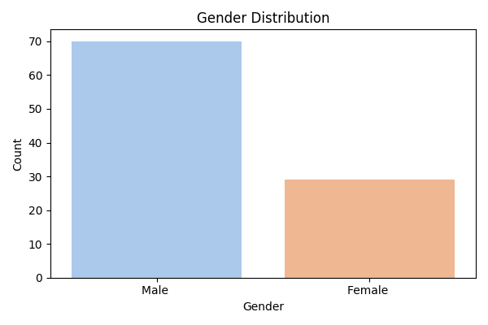
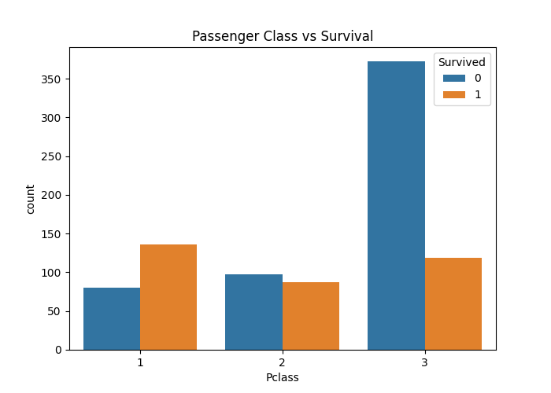
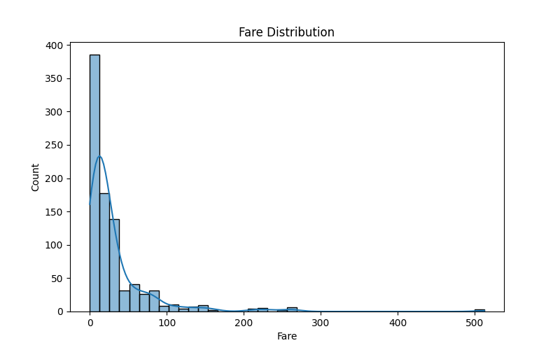
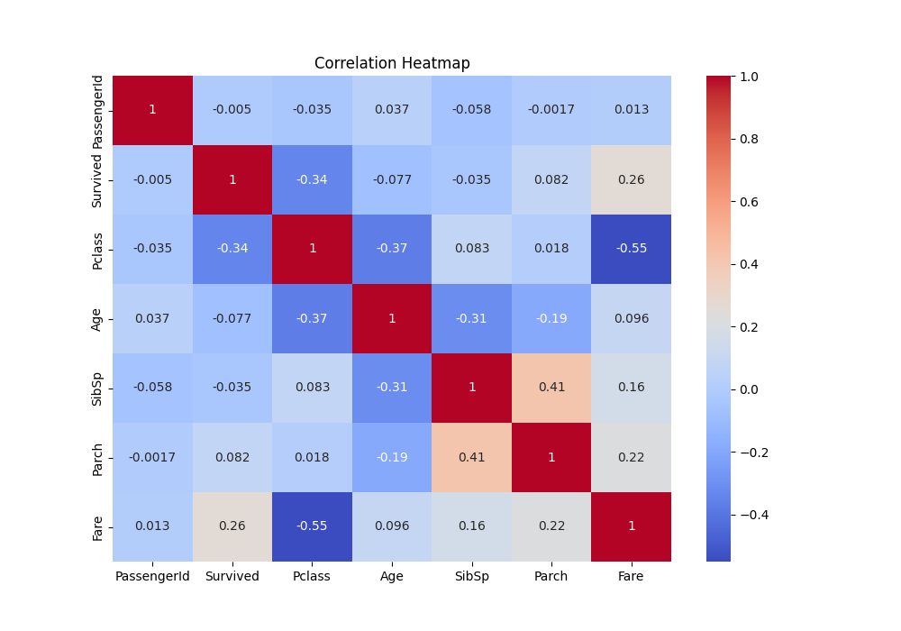
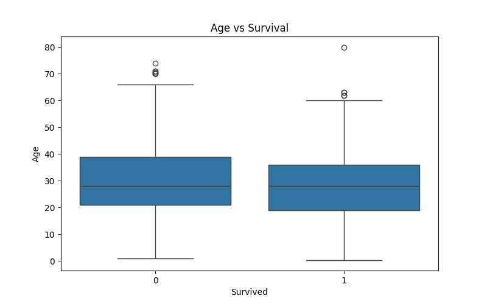
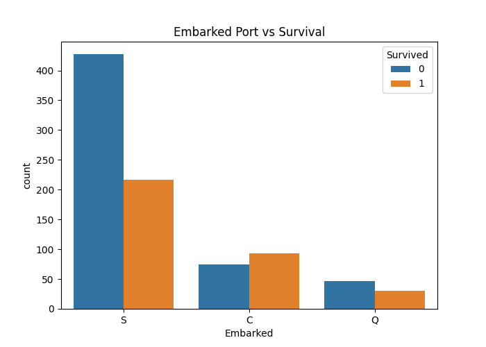

# Titanic Dataset - Exploratory Data Analysis (EDA)

## Overview

This project performs Exploratory Data Analysis (EDA) on the Titanic dataset using Python. The objective is to explore passenger information, clean the data, visualize patterns, and identify factors that influenced survival during the Titanic disaster.

## Tools & Technologies

- Python
- Pandas
- NumPy
- Matplotlib
- Seaborn

## Dataset

The dataset contains passenger details such as:

- Passenger ID
- Passenger Class
- Name
- Gender
- Age
- Fare
- Cabin
- Embarked Port
- Survival Status

## Data Cleaning

The following preprocessing steps were performed:

- Filled missing values in Age using the median.
- Filled missing values in Embarked using the mode.
- Replaced missing Cabin values with "Unknown".
- Checked and removed duplicate records.
- Verified dataset structure and statistics.

## Exploratory Data Analysis

The following visualizations were created:

- Survival Distribution
- Gender Distribution
- Gender vs Survival
- Passenger Class vs Survival
- Age Distribution
- Fare Distribution
- Correlation Heatmap
- Age vs Survival
- Embarked Port vs Survival

## Output Visualizations

### Gender Distribution


### Survival Distribution


### Gender vs Survival


### Passenger Class vs Survival


### Age Distribution


### Fare Distribution


### Correlation Heatmap


### Age vs Survival


### Embarked Port vs Survival


## Key Insights

- Female passengers had significantly higher survival rates than male passengers.
- First-class passengers were more likely to survive than passengers in lower classes.
- Younger passengers showed slightly better survival chances.
- Fare and passenger class had a noticeable relationship with survival.
- Most passengers embarked from Southampton.
- Passenger demographics played an important role in survival outcomes.

## Project Structure

```text
SCT_DS_2/
│
├── train.csv
├── test.csv
├── SCT_DS_2.py
├── README.md
├── gender_distribution.png
├── survival_distribution.png
├── gender_vs_survival.png
├── passengerclass_vs_survival.png
├── age_distribution.png
├── fare_distribution.png
├── correlation_heat.png
├── age_vs_survival.png
└── embarked_port_vs_survival.png
```

## Conclusion

This analysis provides valuable insights into the Titanic dataset through data cleaning, visualization, and statistical exploration. The findings highlight the impact of factors such as gender, passenger class, age, and fare on survival outcomes.

## Author

**Ch. Akshara**  
BVRIT Hyderabad  
SkillCraft Technology – Data Science Intern
