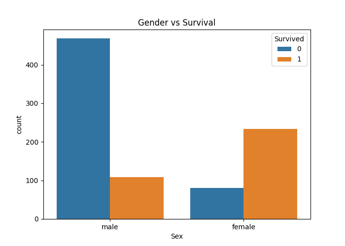

# Titanic Dataset - Exploratory Data Analysis

## Overview

This project performs Exploratory Data Analysis (EDA) on the Titanic dataset to identify factors affecting passenger survival.

## Tools Used

* Python
* Pandas
* NumPy
* Matplotlib
* Seaborn

## Data Cleaning

* Filled missing values in Age using median.
* Filled missing values in Embarked using mode.
* Replaced missing Cabin values with "Unknown".
* Removed duplicate records.

## Visualizations

* Survival Distribution
* Gender vs Survival
* Passenger Class vs Survival
* Age Distribution
* Fare Distribution
* Correlation Heatmap
* Age vs Survival
* Embarked vs Survival

## Key Insights

* Female passengers had higher survival rates.
* First-class passengers were more likely to survive.
* Passenger class and fare showed a relationship with survival.
* Most passengers embarked from Southampton.

## Author

Ch. Akshara
BVRIT Hyderabad
SkillCraft Technology - Data Science Intern
## Survival Distribution

## Gender vs Survival

## Passenger Class vs Survival

## Correlation Heatmap

